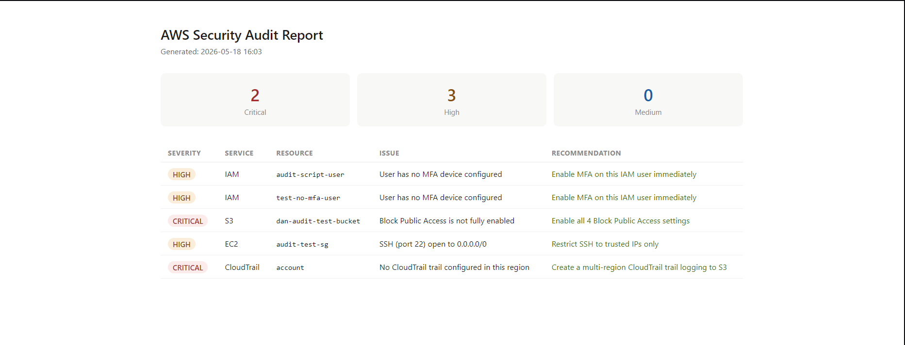
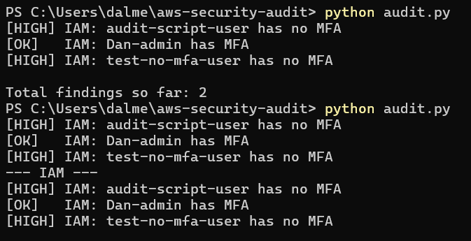
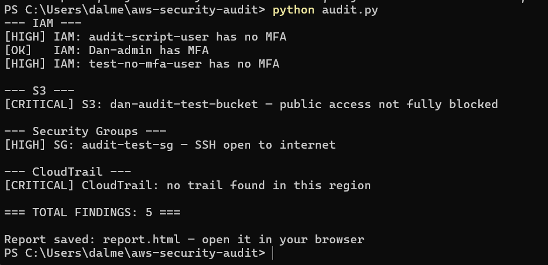

# AWS Security Audit Tool

A Python tool that audits an AWS account against CIS Benchmark controls 
and generates an HTML report of security findings.

Built as part of my cloud security engineering portfolio.

## What it checks

| Check | Service | Severity if failed |
|---|---|---|
| IAM users without MFA | IAM | HIGH |
| S3 Block Public Access disabled | S3 | CRITICAL |
| Security groups with SSH/RDP open to 0.0.0.0/0 | EC2 | HIGH |
| CloudTrail logging disabled or missing | CloudTrail | CRITICAL |

## Real findings from my own AWS account

Running this tool against my own lab account returned 5 findings:

- **2x HIGH** — IAM users with no MFA configured
- **1x CRITICAL** — S3 bucket with Block Public Access disabled
- **1x HIGH** — Security group with SSH open to the internet (0.0.0.0/0)
- **1x CRITICAL** — No CloudTrail trail active in the region

These were intentionally created misconfigurations used to validate 
the tool's detection accuracy.

## Report output



## Terminal output





## How to run it

**Requirements:** Python 3.x, boto3, AWS CLI configured with read-only credentials

```bash
pip install boto3
python audit.py
```

The script outputs findings to the terminal and saves a formatted 
HTML report to `report.html`.

## IAM permissions required

The tool runs with a least-privilege IAM user. The only permissions 
needed are:

```json
{
  "Actions": [
    "iam:ListUsers",
    "iam:ListMFADevices",
    "s3:ListAllMyBuckets",
    "s3:GetPublicAccessBlock",
    "ec2:DescribeSecurityGroups",
    "cloudtrail:DescribeTrails",
    "cloudtrail:GetTrailStatus"
  ]
}
```

## What I learned

- How to use boto3 to interact with AWS services programmatically
- CIS Benchmark controls for IAM, S3, EC2, and CloudTrail
- Why least-privilege IAM credentials matter even for read-only scripts
- How misconfigured S3 buckets and open security groups create real 
  attack surface (same class of finding as the Capital One breach)

## Tech used

Python · boto3 · AWS IAM · S3 · EC2 · CloudTrail · CIS Benchmarks
